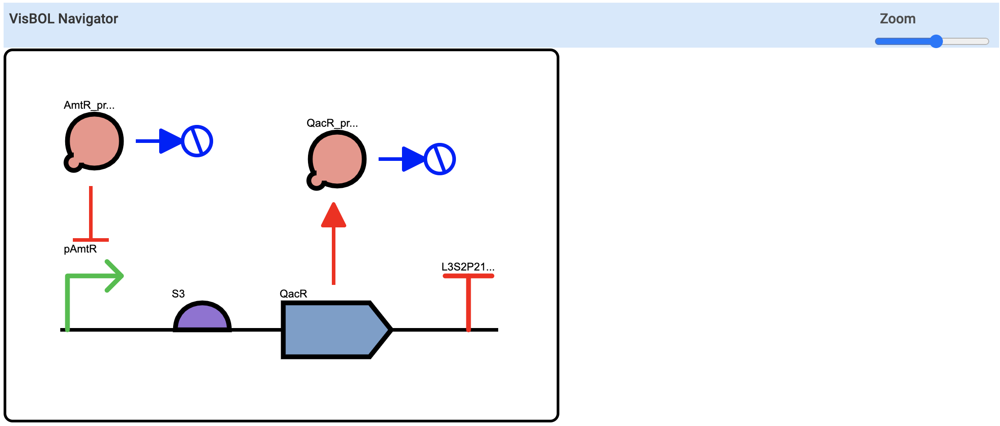
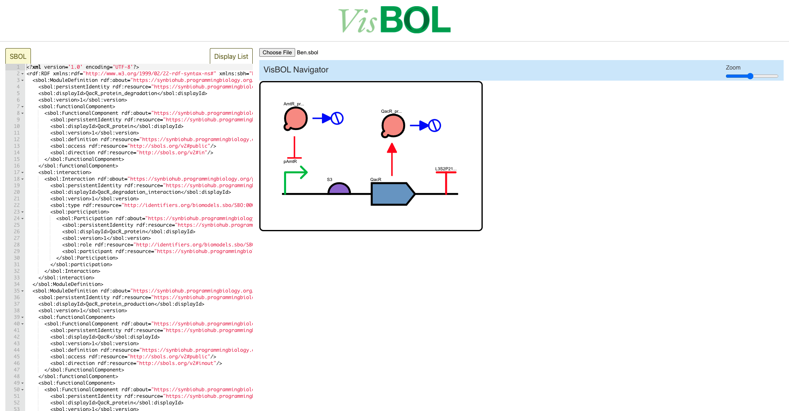

**VisBOL** is an open source project providing visualization of synthetic biology designs using the [SBOL Visual](https://sbolstandard.org/visual-glyphs/) glyph set. VisBOL currently supports generation of designs from [SBOL](https://sbolstandard.org/) documents.

# Interface

# Architecture

VisBOL practices a strict separation between the front-end and back-end.

## Back-end:

VisBOL's back-end parses SBOL files and extracts relevant data needed to visualize the design.

There are two major javascript functions exported from the back-end - createDisplay and prepareDisplay

**createDisplay** is a Javascript function which takes in SBOL (in the form of a string) and generates a Javascript
Promise object. If the SBOL is able to be parsed without any errors, this Promise will resolve as a "display list". This display
list is an array of Javascript objects that each represent a node, or "glyph", in the synthetic design.

**prepareDisplay** is a Javascript function which takes in a display list (see createDisplay explanation above) and generates a
Javascript object that VisBOL's front-end uses to generate a visualization (see **FRONT_END** section below).

## Front-end:

VisBOL's front-end is a [React](https://reactjs.org/) component. The react component accepts an object generated by the back-end's **prepareDisplay** function (see above) as a prop
and renders an svg representing the corresponding synthetic biology design. The **Interface** section shows an example rendering by VisBOL's front-end.

# Installation & How to use

## Installation

VisBOL's back-end can be installed via npm or yarn:

Via npm: `npm install visbol`
Via yarn: `yarn add visbol`

VisBOL's front-end can be installed via npm or yarn:

Via npm: `npm install visbol-react`
Via yarn: `yarn add visbol-react`

## How to use

**1)** Create the backing data structure the front-end needs for rendering.

Pass an SBOL file in the form of a string to the back-end's **createDisplay** function. This function returns a Javascript Promise, which will resolve as a "display list" (the backing data structure) that will be used to render the SBOL file: 
`import { createDisplay } from 'visbol'` 
`const getDisplayListPromise = createDisplay(<SBOL string here>);` 

**2)** Prepare the backing data structure for the front-end.

Pass the display list obtained from the promise returned by VisBOL's createDisplay function (see step 1 above) to VisBOL's **prepareDisplay** function. This function will return a JSON object that we will pass to VisBOL's front-end renderer component: 
`import { prepareDisplay } from 'visbol'` 
`var preparedDisplay = {};` 
`getDisplayListPromise.then(displayList => {preparedDisplay = prepareDisplay(displayList)});` 

**3)** Pass the prepared JSON obtained from step 2 to the front-end to be rendered

VisBOL 2's front-end is a React component. If your web-app uses [React](https://reactjs.org/), simply pass the JSON object created in step 2 as the **display** prop to the component: 
`import FrontEnd from 'visbol-react'` 
`<FrontEnd display={preparedDisplay} />` 
Note: `preparedDisplay` is the JSON object we created in step 2.

If your web-app does not use React:
1) Install `React` and `ReactDOM` using npm 
`npm i react` 
`npm i react-dom` 
You can also use yarn to install these two packages. 
`yarn add react` 
`yarn add react-dom` 
2) Import these two packages, along with VisBOL's front-end React component. Use these packages to
render VisBOL's front-end React component. 
`import React from 'react'` 
`import ReactDOM from 'react-dom'` 
`import FrontEnd from 'visbol-react'` 
`ReactDOM.render(<FrontEnd display={preparedDisplay}/>, document.getElementById("<ID of div you want the front-end to be placed in>"))` 
Note: `preparedDisplay` is the JSON object we created in step 2.

# Website/Example Renderings

One can view VisBOL 2's rendering of SBOL files using VisBOL 2's website.

1) First, clone the website repository: `git clone https://github.com/VisBOL/visbol2.git`
2) Then, enter the VisBOL 2 Website directory: `cd website`
3) Install dependences: `yarn install`
4) Start the website locally: `npm start`
5) The website can now be visited at `http://localhost:3000/`
6) You can choose SBOL files to render using the file input, or you
   can copy and paste SBOL into the SBOL editor on the left (see website interface below).

# Publishing

To publish the latest version of the backend:

1) Navigate to the back-end directory: `cd backend`
2) Open `package.json`
3) Update the version number
4) Run `npm publish`

To publish the latest version of the front-end:

1) Navigate to the front-end directory: `cd frontend`
2) Run `npm run build`
2) Open `package.json`
3) Update the version number
4) Run `npm publish`